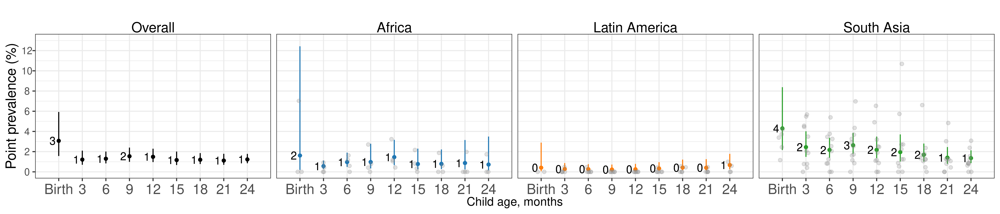

# Prevalence and incidence of severe growth failure {#severe}

---
output:
  pdf_document:
    keep_tex: yes
fontfamily: mathpazo
fontsize: 9pt
---

\raggedright

## Overview

This page presents age-specific prevalence and incidence results for severe wasting (weight-for-length Z-score < -3) and severe underweight (weight-for-age Z-score < -3) in the KI cohorts.

## Age-specific prevalence of severe wasting

## Age-specific cumulative incidence of severe wasting

## Age-specific prevalence of severe underweight

