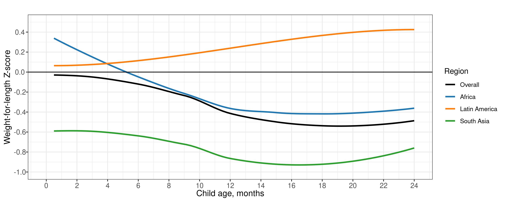
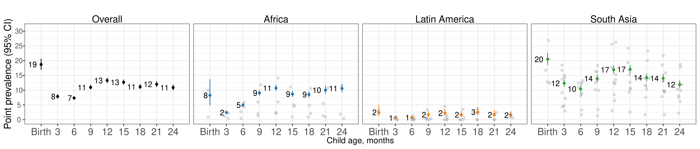
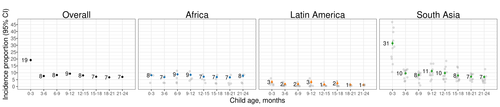
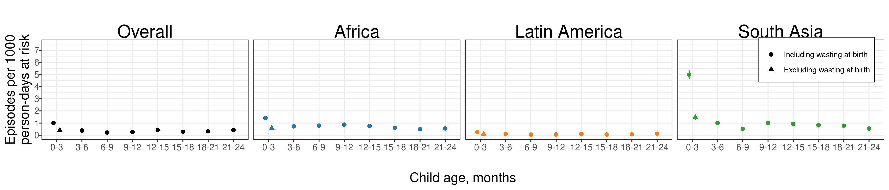
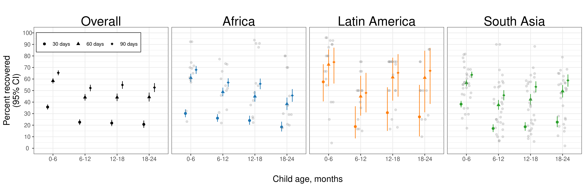
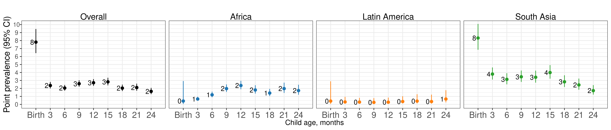
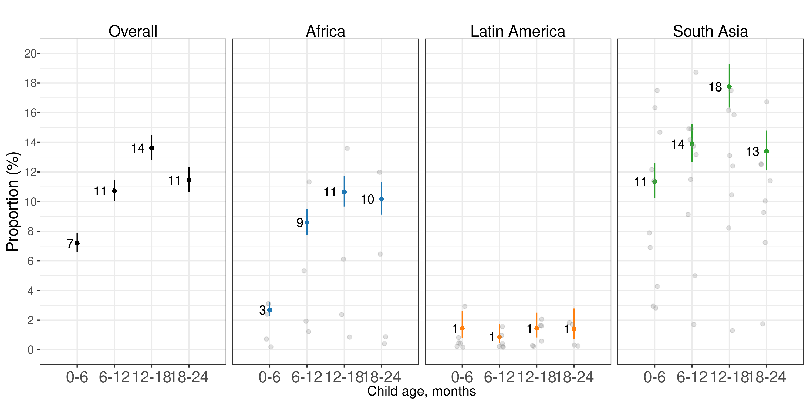
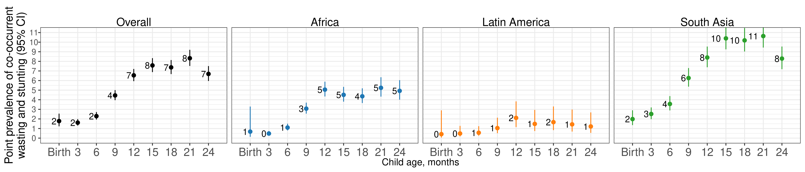
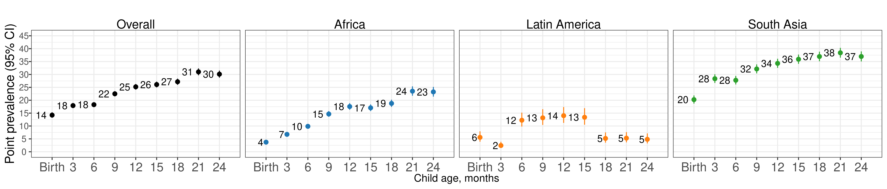

# Sensitivity analysis dropping at-Birth measures in Kenaba {#no-kenaba}

---
output:
  pdf_document:
    keep_tex: yes
fontfamily: mathpazo
fontsize: 9pt
---

\raggedright

## Overview

Here, we re-estimate primary results after dropping the observations of children at birth within the MRC Kenaba cohort, which used a different team to measure child anthropometry at birth from the trained anthropometrists used in follow-up measurements. While other cohort data from the Kenaba area show that children tend to experience decreased LAZ after birth, in the MRC Kenaba data used in this analysis, we see a high birth LAZ (approximately 0) and a rapid drop in LAZ in followup measurements (approximately -1 at one month).
we see that the at birth measurements LAZ is ~0, and then for the follow-up measurements after the mean LAZ is ~ -1 (and the mean LAZ of just the subsequent follow-up visit at one month is ~ -1). We calculated 30% of measurements taken within two weeks of birth are lower than the at birth measurement beyond the technical error of measurement, and so are unrealistic decreases in child length, and 43% of follow-up measurements within two weeks of birth are less than the at-birth measurement by any amount. 

## Mean WLZ by region

## Age-specific prevalence

## Age-specific incidence

## Age-specific incidence rate

## Age-specific recovery

## Age-specific prevalence of severe wasting

## Age-specific longitudinal prevalence of persistent wasting

## Age-specific prevalence of concurrent wasting and stunting

## Age-specific prevalence of underweight (weight-for-age Z-score < -2)

