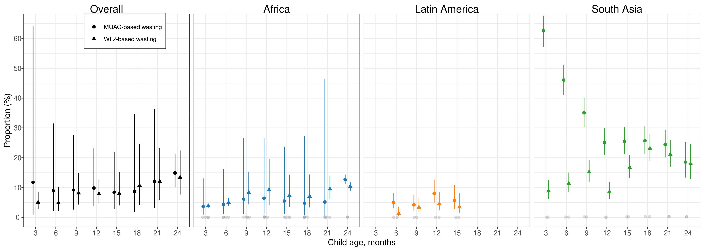

# Sensitivity analysis comparing wasting defined via weight-for-length versus middle-upper arm circumference {#muac}

---
output:
  pdf_document:
    keep_tex: yes
fontfamily: mathpazo
fontsize: 9pt
---

\raggedright

MUAC was only measured in a subset of cohorts. (FILL IN)

