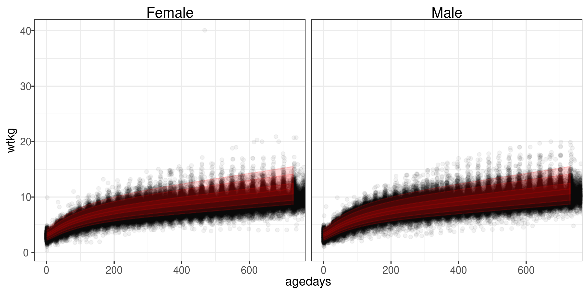
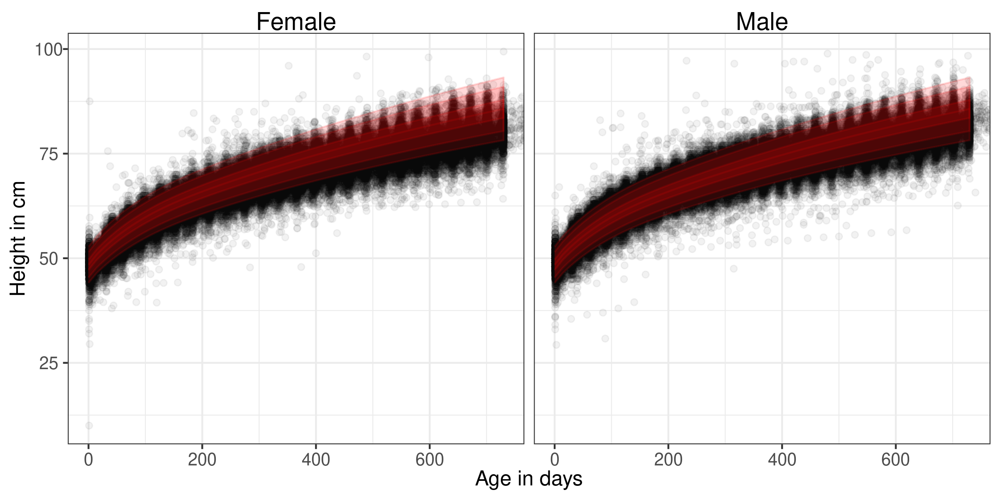
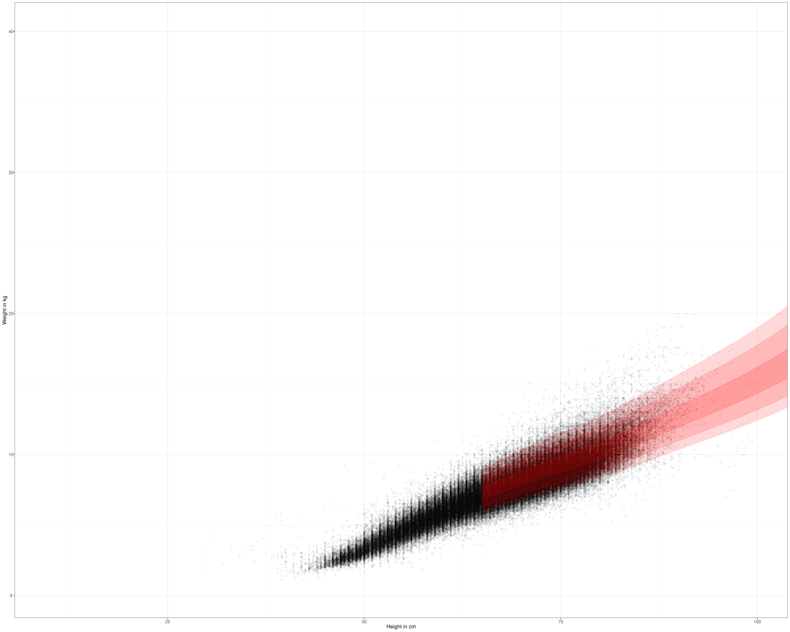
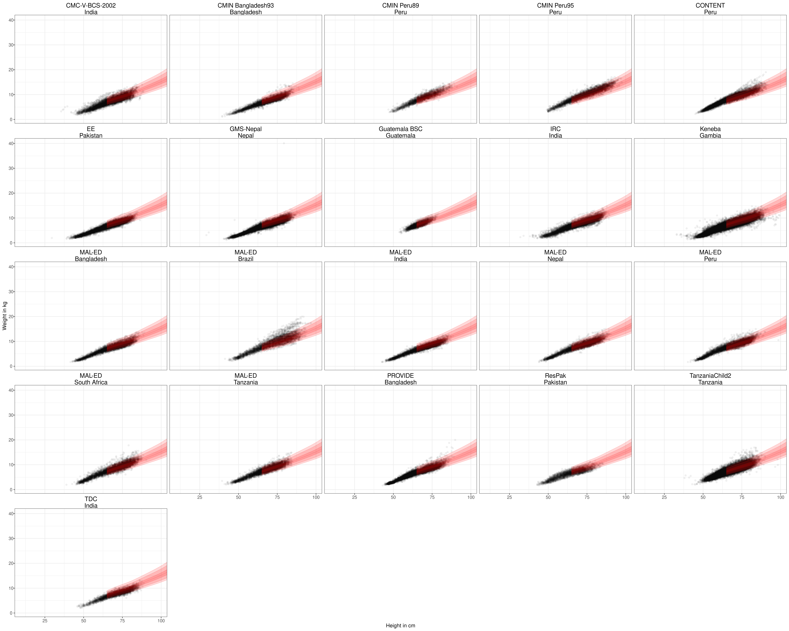
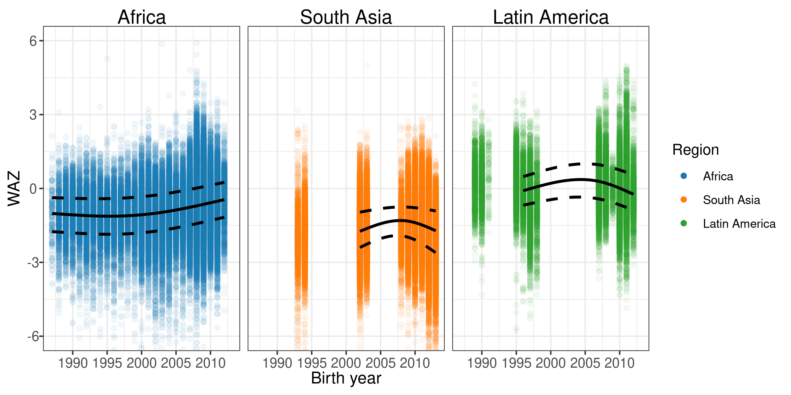
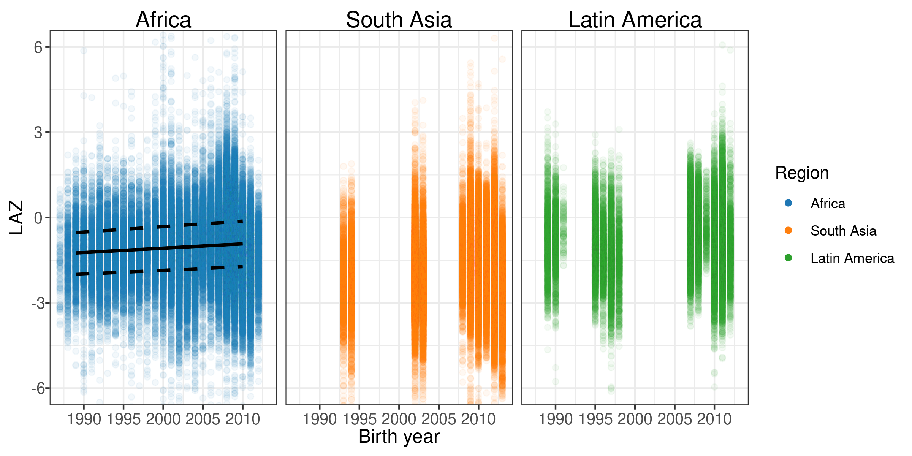
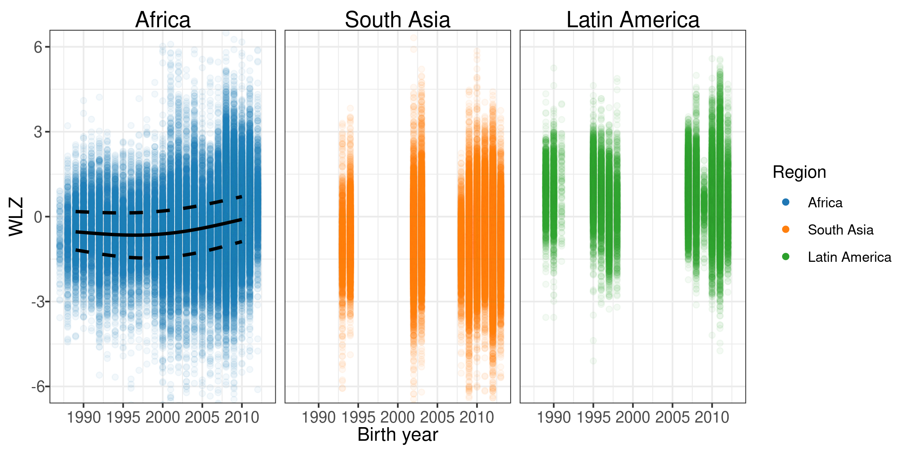

# Anthropometry measurement quality {#anthro}

---
output:
  pdf_document:
    keep_tex: yes
fontfamily: mathpazo
fontsize: 9pt
---

\raggedright

## Anthropometry measuresments compared to WHO standards

To check for outliers in length measurements, We plotted the distribution of raw length and weight measurements by age and sex against bands marking the first, second, and third standard deviations of the World Health Organization child growth standard distribution. The majority of observations fell within 3 standard deviations of the mean of the standard for males and females. 

## Age-specific incidence

This study included cohorts that measured child growth from 1987 to 2014. To assess potential secular trends, we plotted the mean LAZ, WAZ, and WLZ over time. The plot below shows the individual observations from included studies over this range of years. There does not appear to be a secular trend in LAZ, WAZ, or WLZ. 

