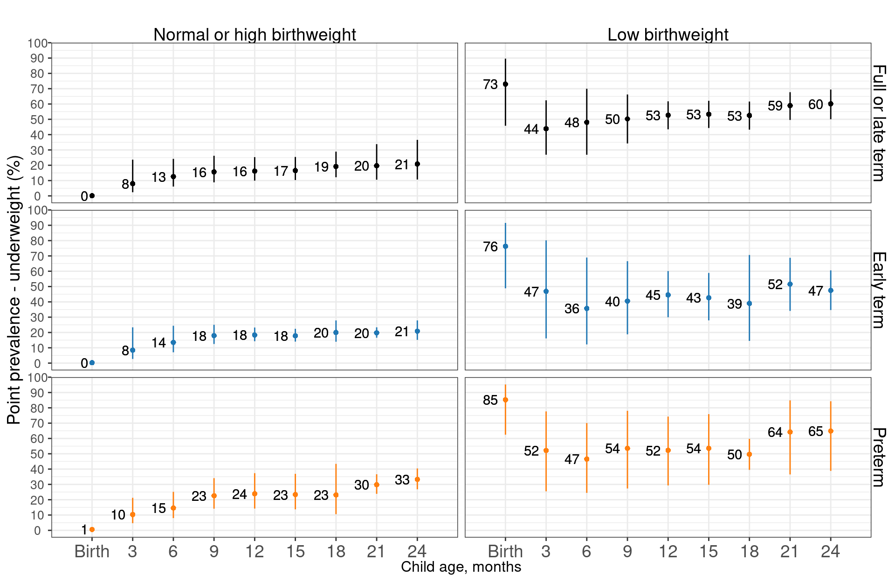
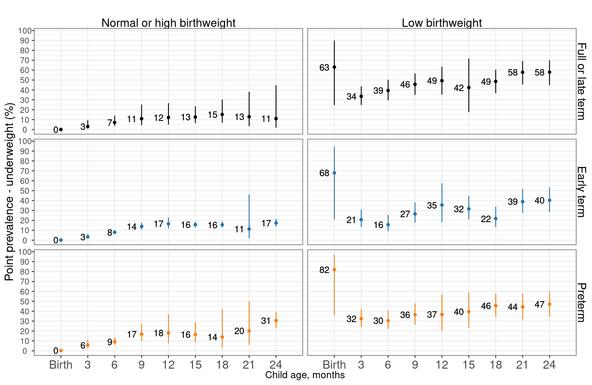

# Child wasting and underweight stratified by low birthweight and preterm birth status {#BWstrat}

---
output:
  pdf_document:
    keep_tex: yes
fontfamily: mathpazo
fontsize: 9pt
---

\raggedright

## Tables of birthweight and gestational age availability.

Note that gestational age was only measured in four small cohorts with monthly measurements, two from sub-Saharan Africa and two from India. The Indian cohorts in particular include a little over 200 children each. Some estimates are grouped by region, but note the data is not sufficient in number of children or diversity of populations to make regional extrapolations, especially for the rare categories like born preterm with normal birthweight (>2500g). The gestational age data is also not based on ultrasound data, so is measured imprecisely based on last menstrual recall or the Dubowitz method (newborn exam).

|Study                   |Normal or high birthweight |Low birthweight |
|:-----------------------|:--------------------------|:---------------|
|CMC-V-BCS-2002-INDIA    |322 (88.2%)                |43 (11.8%)      |
|EE-PAKISTAN             |245 (64.6%)                |134 (35.4%)     |
|GMS-Nepal-NEPAL         |96 (68.6%)                 |44 (31.4%)      |
|IRC-INDIA               |335 (82.9%)                |69 (17.1%)      |
|Keneba-GAMBIA           |1805 (85.2%)               |313 (14.8%)     |
|MAL-ED-BANGLADESH       |203 (78.7%)                |55 (21.3%)      |
|MAL-ED-BRAZIL           |221 (94.8%)                |12 (5.2%)       |
|MAL-ED-INDIA            |205 (83.7%)                |40 (16.3%)      |
|MAL-ED-NEPAL            |212 (91%)                  |21 (9%)         |
|MAL-ED-PERU             |279 (93.3%)                |20 (6.7%)       |
|MAL-ED-SOUTH AFRICA     |290 (92.4%)                |24 (7.6%)       |
|MAL-ED-TANZANIA         |125 (94.7%)                |7 (5.3%)        |
|PROVIDE-BANGLADESH      |532 (76%)                  |168 (24%)       |
|TanzaniaChild2-TANZANIA |2293 (96.5%)               |82 (3.5%)       |
|TDC-INDIA               |133 (88.1%)                |18 (11.9%)      |

|Study                   |Full or late term |Early term  |Preterm     |
|:-----------------------|:-----------------|:-----------|:-----------|
|CMC-V-BCS-2002-INDIA    |215 (61.3%)       |84 (23.9%)  |52 (14.8%)  |
|IRC-INDIA               |250 (64.1%)       |98 (25.1%)  |42 (10.8%)  |
|Keneba-GAMBIA           |847 (49.4%)       |609 (35.6%) |257 (15%)   |
|TanzaniaChild2-TANZANIA |1393 (61.7%)      |515 (22.8%) |350 (15.5%) |

|Study                   |Normal or high birthweight-Full or late term |Normal or high birthweight-Early term |Normal or high birthweight-Preterm |Low birthweight-Full or late term |Low birthweight-Early term |Low birthweight-Preterm |
|:-----------------------|:--------------------------------------------|:-------------------------------------|:----------------------------------|:---------------------------------|:--------------------------|:-----------------------|
|CMC-V-BCS-2002-INDIA    |195 (56.7%)                                  |70 (20.3%)                            |39 (11.3%)                         |16 (4.7%)                         |12 (3.5%)                  |12 (3.5%)               |
|IRC-INDIA               |217 (56.1%)                                  |76 (19.6%)                            |27 (7%)                            |33 (8.5%)                         |20 (5.2%)                  |14 (3.6%)               |
|Keneba-GAMBIA           |756 (44.8%)                                  |516 (30.6%)                           |173 (10.2%)                        |80 (4.7%)                         |82 (4.9%)                  |82 (4.9%)               |
|TanzaniaChild2-TANZANIA |1356 (60.6%)                                 |492 (22%)                             |315 (14.1%)                        |26 (1.2%)                         |16 (0.7%)                  |33 (1.5%)               |

## Weight-for-age Z-scores (WAZ)

### Age-specific WAZ stratified by birthweight

### Age-specific WAZ stratified by gestational age

### Age-specific WAZ stratified by birthweight and gestational age

## Weight-for-length Z-scores (WLZ)

### Age-specific WLZ stratified by birthweight 

### Age-specific WLZ stratified by gestational age

### Age-specific WLZ stratified by birthweight and gestational age

## Prevalence of wasting

### Age-specific prevalence of wasting, stratified by birthweight

### Age-specific prevalence of wasting, stratified by gestational age

### Age-specific prevalence of wasting, stratified by birthweight and gestational age

#### Overall

#### African cohorts

#### South Asian cohorts

## Prevalence of underweight

### Age-specific prevalence of underweight, stratified by birthweight

### Age-specific prevalence of underweight, stratified by gestational age

### Age-specific prevalence of underweight, stratified by birthweight and gestational age

#### Overall

#### African cohorts

#### South Asian cohorts

