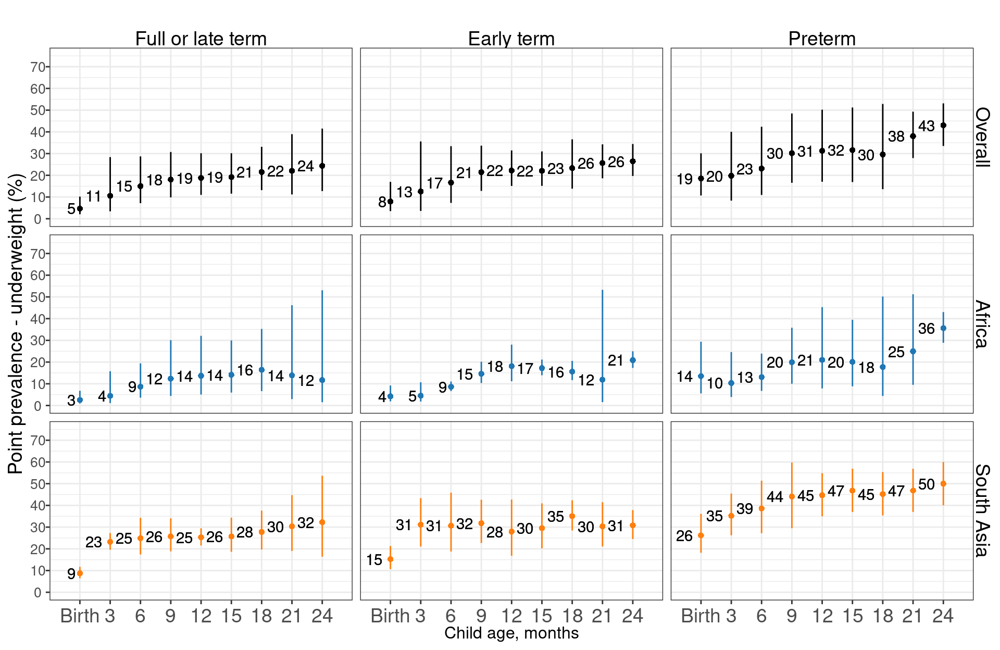

# Child wasting and underweight stratified by low birthweight and preterm birth status {#BWstrat}

---
output:
  pdf_document:
    keep_tex: yes
fontfamily: mathpazo
fontsize: 9pt
---

\raggedright


## Weight-for-age Z-score (WAZ)


## Weight-for-length Z-score (WLZ)


## Age-specific prevalence of wasting, stratified by birthweight


## Age-specific prevalence of wasting, stratified by gestational age


## Age-specific prevalence of wasting, stratified by birthweight and gestational age

#### Overall


#### African cohorts


#### South Asian cohorts


## Age-specific prevalence of underweight, stratified by birthweight


## Age-specific prevalence of underweight, stratified by gestational age


## Age-specific prevalence of underweight, stratified by birthweight and gestational age

#### Overall


#### African cohorts


#### South Asian cohorts




## Tables


```{=html}
<div id="htmlwidget-befb15b3ad57f7ac60f0" style="width:100%;height:auto;" class="datatables html-widget"></div>
<script type="application/json" data-for="htmlwidget-befb15b3ad57f7ac60f0">{"x":{"filter":"none","data":[["1","2","3","4","5","6","7","8","9","10","11","12","13","14","15"],["CMC-V-BCS-2002-INDIA","EE-PAKISTAN","GMS-Nepal-NEPAL","IRC-INDIA","Keneba-GAMBIA","MAL-ED-BANGLADESH","MAL-ED-BRAZIL","MAL-ED-INDIA","MAL-ED-NEPAL","MAL-ED-PERU","MAL-ED-SOUTH AFRICA","MAL-ED-TANZANIA","PROVIDE-BANGLADESH","TanzaniaChild2-TANZANIA","TDC-INDIA"],["322 (88.2%)","245 (64.6%)","96 (68.6%)","335 (82.9%)","1805 (85.2%)","203 (78.7%)","221 (94.8%)","205 (83.7%)","212 (91%)","279 (93.3%)","290 (92.4%)","125 (94.7%)","532 (76%)","2293 (96.5%)","133 (88.1%)"],["43 (11.8%)","134 (35.4%)","44 (31.4%)","69 (17.1%)","313 (14.8%)","55 (21.3%)","12 (5.2%)","40 (16.3%)","21 (9%)","20 (6.7%)","24 (7.6%)","7 (5.3%)","168 (24%)","82 (3.5%)","18 (11.9%)"]],"container":"<table class=\"display\">\n  <thead>\n    <tr>\n      <th> <\/th>\n      <th>Study<\/th>\n      <th>Normal or high birthweight<\/th>\n      <th>Low birthweight<\/th>\n    <\/tr>\n  <\/thead>\n<\/table>","options":{"order":[],"autoWidth":false,"orderClasses":false,"columnDefs":[{"orderable":false,"targets":0}]}},"evals":[],"jsHooks":[]}</script>
```


```{=html}
<div id="htmlwidget-642e46cdd370fe5cc878" style="width:100%;height:auto;" class="datatables html-widget"></div>
<script type="application/json" data-for="htmlwidget-642e46cdd370fe5cc878">{"x":{"filter":"none","data":[["1","2","3","4"],["CMC-V-BCS-2002-INDIA","IRC-INDIA","Keneba-GAMBIA","TanzaniaChild2-TANZANIA"],["195 (56.7%)","217 (56.1%)","756 (44.8%)","1356 (60.6%)"],["70 (20.3%)","76 (19.6%)","516 (30.6%)","492 (22%)"],["39 (11.3%)","27 (7%)","173 (10.2%)","315 (14.1%)"],["16 (4.7%)","33 (8.5%)","80 (4.7%)","26 (1.2%)"],["12 (3.5%)","20 (5.2%)","82 (4.9%)","16 (0.7%)"]],"container":"<table class=\"display\">\n  <thead>\n    <tr>\n      <th> <\/th>\n      <th>Var1<\/th>\n      <th>prop.x<\/th>\n      <th>prop.y<\/th>\n      <th>prop.x.x<\/th>\n      <th>prop.y.y<\/th>\n      <th>prop<\/th>\n    <\/tr>\n  <\/thead>\n<\/table>","options":{"order":[],"autoWidth":false,"orderClasses":false,"columnDefs":[{"orderable":false,"targets":0}]}},"evals":[],"jsHooks":[]}</script>
```


```{=html}
<div id="htmlwidget-80ea41403a6838613174" style="width:100%;height:auto;" class="datatables html-widget"></div>
<script type="application/json" data-for="htmlwidget-80ea41403a6838613174">{"x":{"filter":"none","data":[["1","2","3","4"],["CMC-V-BCS-2002-INDIA","IRC-INDIA","Keneba-GAMBIA","TanzaniaChild2-TANZANIA"],["195 (56.7%)","217 (56.1%)","756 (44.8%)","1356 (60.6%)"],["70 (20.3%)","76 (19.6%)","516 (30.6%)","492 (22%)"],["39 (11.3%)","27 (7%)","173 (10.2%)","315 (14.1%)"],["16 (4.7%)","33 (8.5%)","80 (4.7%)","26 (1.2%)"],["12 (3.5%)","20 (5.2%)","82 (4.9%)","16 (0.7%)"],["12 (3.5%)","14 (3.6%)","82 (4.9%)","33 (1.5%)"]],"container":"<table class=\"display\">\n  <thead>\n    <tr>\n      <th> <\/th>\n      <th>Study<\/th>\n      <th>Normal or high birthweight-Full or late term<\/th>\n      <th>Normal or high birthweight-Early term<\/th>\n      <th>Normal or high birthweight-Preterm<\/th>\n      <th>Low birthweight-Full or late term<\/th>\n      <th>Low birthweight-Early term<\/th>\n      <th>Low birthweight-Preterm<\/th>\n    <\/tr>\n  <\/thead>\n<\/table>","options":{"order":[],"autoWidth":false,"orderClasses":false,"columnDefs":[{"orderable":false,"targets":0}]}},"evals":[],"jsHooks":[]}</script>
```


