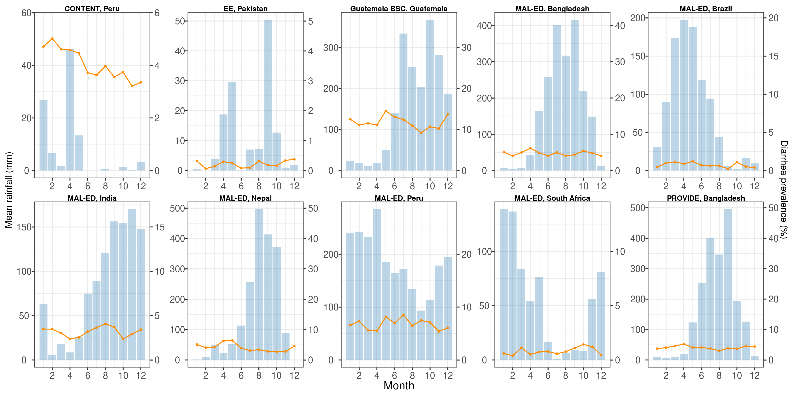

# Associations between rainfall and diarrheal disease prevalence. {#diarr_rain}

---
output:
  pdf_document:
    keep_tex: yes
fontfamily: mathpazo
fontsize: 9pt
---

\raggedright

This figure shows plots of diarrhea prevalence and rainfall by month of the year among cohorts with diarrheal disease frequently measured. The left axis shows rainfall in millimeters (details in Methods) and the right axis show monthly diarrheal disease prevalence by study. There does not appear to be a clear seasonality in diarrhea coinciding with rainfall
